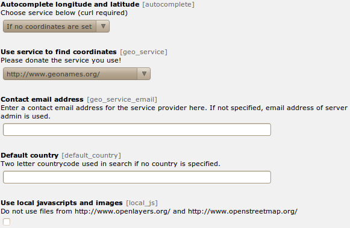

Administration
==============

In the extension configuration



+----------------------------+------------------------------------------------+-------------+
|           Option           |                   Description                  | Default     |
+============================+================================================+=============+
| Autocomplete longitude     | You can enable to search the coordinates on    | 1: If no    |
| and latitude               | geonames.org when saving an fe_users or        | coordinates |
|                            | tt_address element.                            | are set     |
+----------------------------+------------------------------------------------+-------------+
| Use service to find        | Use this service to get the coordinates of an  | 2:          |
| coordinates                | address. If you select “Only cache” you have to| Nominatim   |
|                            | fill the cache table manually. If you select a |             |
|                            | provider here, be aware that the fields “zip”, |             |
|                            | “city” and “country” of every address record   |             |
|                            | you save is sent to the provider.              |             |
+----------------------------+------------------------------------------------+-------------+
| Contact email address      | Enter a contact email address for the service  |             |
|                            | provider here. If not specified, email address |             |
|                            | of server admin is used.                       |             |
+----------------------------+------------------------------------------------+-------------+
| Use local javascripts and  | Activate this if you don't like to use the     | 1           |
| images                     | javascript files from CDNs but the local ones  |             |
|                            | from this extension.                           |             |
+----------------------------+------------------------------------------------+-------------+

There is a function to mass gecode addresses in the functions menu.

Configuration
=============

Reference
---------

.. |mpi| replace:: marker_popup_initial
.. |sls| replace:: show_layerswitcher
.. |uconm| replace:: use_coords_only_nomarker

.. |ol| replace:: openlayers

+-----------------+-----------+-------------------------------------+---------+
|     Property    | Data type |             Description             | Default |
+=================+===========+=====================================+=========+
| cluster         | boolean   | Cluster marker at lower map zoom.   | 0       |
+-----------------+-----------+-------------------------------------+---------+
| cluster_radius  | integer   | Cluster marker in given radius.     | 80      |
+-----------------+-----------+-------------------------------------+---------+
| external_control| boolean   || Allow control with GET or POST     | 0       |
|                 |           || lon: Map center longitude          |         |
|                 |           || lat: Map center latitudezoom: Map  |         |
|                 |           | zoom level                          |         |
|                 |           || layers: Comma separated list of    |         |
|                 |           | tx_odsosm_layer uid's               |         |
|                 |           || records: Comma separated list of   |         |
|                 |           | markers                             |         |
|                 |           || Don't forget to set no_cache=1     |         |
+-----------------+-----------+-------------------------------------+---------+
| height          | integer   |                                     | 400     |
+-----------------+-----------+-------------------------------------+---------+
| icon            | IMAGE or  | Default marker image                | Library |
|                 | TEXT      |                                     | default |
|                 | object    |                                     |         |
+-----------------+-----------+-------------------------------------+---------+
| JSlibrary       | string    | JavaScript library: none / jquery   | none    |
+-----------------+-----------+-------------------------------------+---------+
| layer           | integer   || Comma separated list of            | 1       |
|                 | list      | tx_odsosm_layer uid's.              |         |
|                 |           || 1: Mapnik                          |         |
|                 |           || 2: SLUB Renderer                   |         |
|                 |           || 3: CycleMap                        |         |
|                 |           || 13: ÖPNV Deutschland               |         |
|                 |           || 14: Hike & Bike Map                |         |
|                 |           || 15: Hillshading (NASA SRTM3 v2)    |         |
|                 |           || 17: Hiking routes                  |         |
|                 |           || 18: Mapnik BW                      |         |
|                 |           || 19: MapSurfer.Net Road             |         |
|                 |           || 20: MapSurfer.Net Topographic      |         |
|                 |           || 21: MapSurfer.Net Hybrid           |         |
|                 |           || 25: TransportMap                   |         |
|                 |           || 28: Cycling routes                 |         |
|                 |           || 29: Stamen Toner                   |         |
|                 |           || 30: Stamen Watercolor              |         |
|                 |           || 31: Public Transport Lines         |         |
|                 |           || 32: Stamen Terrain Labels          |         |
|                 |           || 33: Railway Infrastructure         |         |
+-----------------+-----------+-------------------------------------+---------+
| layerswitcher.  | boolean   | Use extra div for the layerswitcher.| 0       |
| div             |           |                                     |         |
+-----------------+-----------+-------------------------------------+---------+
| layerswitcher.  | string    | Additional options when creating    |         |
| options         |           | layerswitcher.                      |         |
+-----------------+-----------+-------------------------------------+---------+
| library         | string    | Library: leaflet / openlayers /     | |ol|    |
|                 |           | openlayers3 / static                |         |
+-----------------+-----------+-------------------------------------+---------+
| marker          | array with| Tablenames and a comma separated    | see m_  |
|                 | table name| list of record ids.                 |         |
|                 | and       |                                     |         |
|                 | integer   |                                     |         |
|                 | list      |                                     |         |
+-----------------+-----------+-------------------------------------+---------+
| |mpi|           | integer   | Open popup of this marker           |         |
+-----------------+-----------+-------------------------------------+---------+
| mouse_navigation| boolean   |                                     | 0       |
+-----------------+-----------+-------------------------------------+---------+
| no_marker       | boolean   || If no marker is set:               | 1       |
|                 |           || 0: Hide map                        |         |
|                 |           || 1: Show map                        |         |
+-----------------+-----------+-------------------------------------+---------+
| popup           | TS object | There are two additional fields:    | see p_  |
|                 |           | “group_title” and                   |         |
|                 |           | “group_description” filled with     |         |
|                 |           | group information.                  |         |
+-----------------+-----------+-------------------------------------+---------+
| position        | boolean   | Get current user postion from       | 0       |
|                 |           | browser to center the map.          |         |
+-----------------+-----------+-------------------------------------+---------+
| |sls|           | boolean   |                                     | 0       |
+-----------------+-----------+-------------------------------------+---------+
| show_popups     | boolean   || 0:No                               | 0       |
|                 |           || 1:Click                            |         |
|                 |           || 2:Hover                            |         |
+-----------------+-----------+-------------------------------------+---------+
| show_scalebar   | boolean   | Show a scale line on the map.       | 0       |
+-----------------+-----------+-------------------------------------+---------+
| static_script   | string    | Marker ###STATIC_SCRIPT### in layer |         |
|                 |           | “Include static JavaScript”. Use it |         |
|                 |           | for google or bing maps api key.    |         |
+-----------------+-----------+-------------------------------------+---------+
| |uconm|         | boolean   | Use the default coordinates only if | 0       |
|                 |           | no marker exists.                   |         |
+-----------------+-----------+-------------------------------------+---------+
| width           | integer   |                                     | 640     |
+-----------------+-----------+-------------------------------------+---------+

Examples
--------

::

	plugin.tx_odsosm_pi1 {
		width = 800
		height = 600
		mouse_navigation = 1
	}

.. _m:

Markers
```````

::

	plugin.tx_odsosm_pi1 {
		marker {
			pages =
			fe_users =
			fe_groups =
			tx_odsosm_track =
		}
	}

.. _p:

Popups
``````

::

	plugin.tx_odsosm_pi1 {
		popup {
			fe_users = COA
			fe_users {
				10 = TEXT
				10.field = name
				10.wrap = <h2>|</h2>
				20 = TEXT
				20.field = description
				20.htmlSpecialChars = 1
			}
			tt_address = COA
			tt_address {
				10 = TEXT
				10.field = name
				10.wrap = <h2>|</h2>
				20 = TEXT
				20.field = description
				20.htmlSpecialChars = 0
			}
		}
	}


Icon Property
`````````````

::

	plugin.tx_odsosm_pi1 {
		icon {
			# IMAGE example
			fe_users = IMAGE
			fe_users {
				file = fileadmin/icon.png
				file.width = 60px
			}

			# HTML example
			fe_users = TEXT
			fe_users {
				value = <span>X</span>
				size_x=20
				size_y=30
				offset_x=10
				offset_y=15
			}
		}
	}
