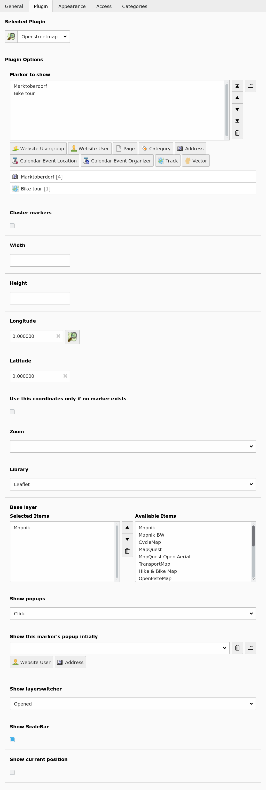
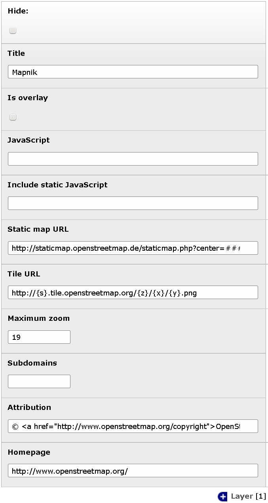
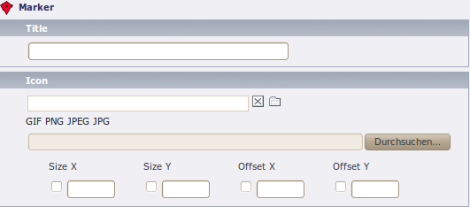
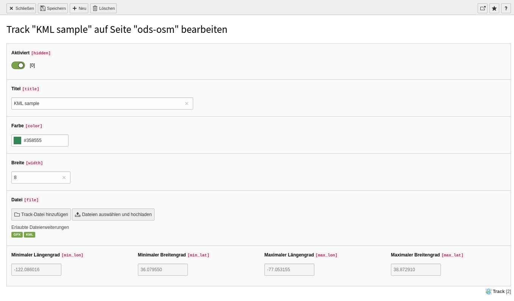
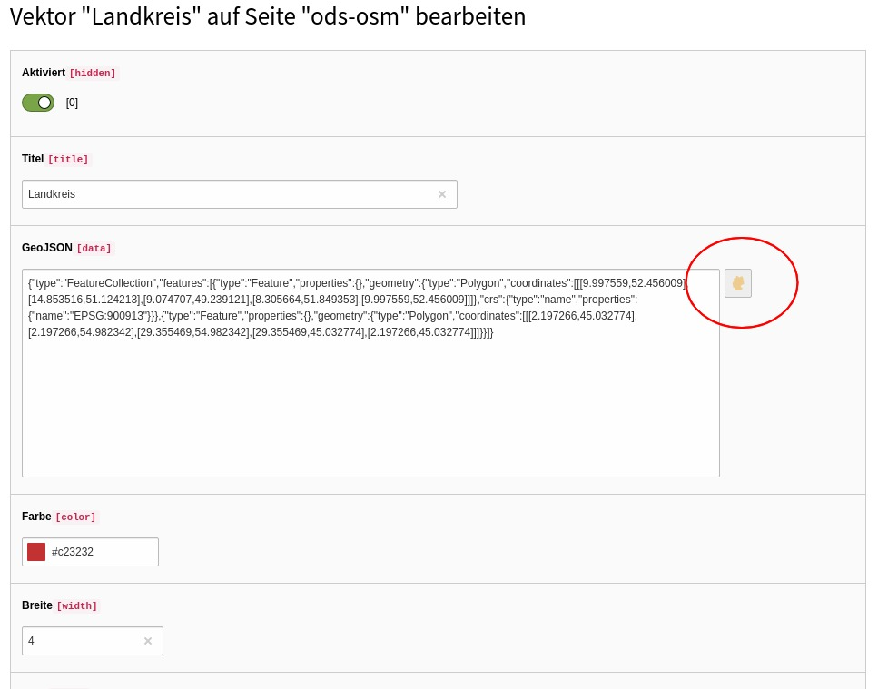
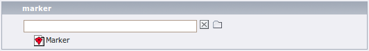

Users manual
============

Frontend Plugin
---------------
Insert the OpenStreetMap as frontend plugin and define at least one marker to show.
The map will center to the average coordinates of the markers.

+----------------------------+------------------------------------------------+
| Plugin option (TS option)  |                  Description                   |
+============================+================================================+
| Marker to show (marker)    | Show these records on the map.                 |
+----------------------------+------------------------------------------------+
| Cluster markers (cluster)  | Group nearby markers.                          |
+----------------------------+------------------------------------------------+
| Width (width)              | Width of the map in pixels.                    |
+----------------------------+------------------------------------------------+
| Height (height)            | Height of the map in pixels.                   |
+----------------------------+------------------------------------------------+
| Longitude (lon)            | Default longitude.                             |
+----------------------------+------------------------------------------------+
| Latitude (lat)             | Default latitude.                              |
+----------------------------+------------------------------------------------+
| Use this coordinates only  | If unset, the map is always centered at the    |
| if no marker exists        | given coordinates. If set, the map is only     |
| (use_coords_only_nomarker) | centered there if no marker exists.            |
+----------------------------+------------------------------------------------+
| Zoom (zoom)                | Zoom level.                                    |
+----------------------------+------------------------------------------------+
| Library (library)          | Choose between openlayers, leaflet or static.  |
+----------------------------+------------------------------------------------+
| Base layer (layer)         | Show this map. The user can switch between     |
|                            | these base layers if the layerswitcher is      |
|                            | is enabled.                                    |
+----------------------------+------------------------------------------------+
| Show popups (show_popups)  | Show a popup window with record information if |
|                            | the user hover or click a marker.              |
+----------------------------+------------------------------------------------+
| Show this marker's popup   | Open this marker's popup if the user visit the |
| initially                  | map.                                           |
| (marker_popup_initial)     |                                                |
+----------------------------+------------------------------------------------+
| Mouse position             | Show position of current mouse cursor.         |
| (mouse_position)           |                                                |
+----------------------------+------------------------------------------------+
| Show layerswitcher         | Show layerswitcher which allows the user to    |
| (show_layerswitcher)       | hide markers from the same group.              |
+----------------------------+------------------------------------------------+
| Show scalebar              | Show pan/zoom element.                         |
| (show_scalebar)            |                                                |
+----------------------------+------------------------------------------------+
| Show current position      | Center the map on the current position of the  |
| (position)                 | user (if available)                            |
+----------------------------+------------------------------------------------+

New elements
------------

Layer
.....

You can define your own layers on root level.

+----------------------------+------------------------------------------------+
|       Element option       |                  Description                   |
+----------------------------+------------------------------------------------+
| Title                      | Title of this layer. Shown in layerswitcher.   |
+----------------------------+------------------------------------------------+
| Is overlay                 | Base layer or overlay layer?                   |
+----------------------------+------------------------------------------------+
| JavaScript                 || JavaScript part to create this layer.         |
|                            || ###TITLE###: Title of layer.                  |
|                            || ###VISIBLE###: Contains “'visible':true” if   |
|                            | is overlay and no layerswitcher activated.     |
+----------------------------+------------------------------------------------+
| Static map URL             || Download static map from this URL.            |
|                            || ###lat###: Latitude of map center.            |
|                            || ###lon###: Longitude of map center.           |
|                            || ###zoom###: Zoom level.                       |
|                            || ###width###: Image width.                     |
|                            || ###height###: Image height.                   |
+----------------------------+------------------------------------------------+
| Tile URL                   | URL to fetch tiles.                            |
|                            | Used by OpenLayers if no JavaScript defined.   |
|                            | Used by leaflet.                               |
+----------------------------+------------------------------------------------+
| Maximum zoom               | Maximum zoom level of this layer.              |
+----------------------------+------------------------------------------------+
| Subdomains                 | Tile URL subdomains (Variable {s})             |
+----------------------------+------------------------------------------------+
| Attribution                | Attribution text of this layer.                |
+----------------------------+------------------------------------------------+
| Homepage                   | Homepage URL of this layer.                    |
+----------------------------+------------------------------------------------+

Marker
......

+----------------------------+------------------------------------------------+
|       Element option       |                  Description                   |
+----------------------------+------------------------------------------------+
| Title                      | Title for this track. Only shown in backend.   |
+----------------------------+------------------------------------------------+
| Icon                       | Icon file.                                     |
+----------------------------+------------------------------------------------+
| Size                       | The size of the icon. Would determined         |
|                            | automatically on save.                         |
+----------------------------+------------------------------------------------+
| Offset                     | The offset of the icon. It describes the       |
|                            | arrowhead. Would automatically choose the      |
|                            | middle bottom of the image.                    |
+----------------------------+------------------------------------------------+

Track
.....

+----------------------------+------------------------------------------------+
|       Element option       |                  Description                   |
+----------------------------+------------------------------------------------+
| Title                      | Title for this track. Shown in layerswitcher.  |
+----------------------------+------------------------------------------------+
| Color                      | Color of the track line in the map.            |
+----------------------------+------------------------------------------------+
| Width                      | Width of the track line.                       |
+----------------------------+------------------------------------------------+
| File                       | Select only one gpx file here.                 |
+----------------------------+------------------------------------------------+

Vector
......

You can add GeoJSON data and/or a GeoJSON file to display on a new layer. The
GeoJSON may contain FeatureCollections. Polygone, Lines and Points are tested
and are supported by the vector draw wizard.

+----------------------------+------------------------------------------------+
|       Element option       |                  Description                   |
+----------------------------+------------------------------------------------+
| Title                      | Title for this vector. Shown in layerswitcher. |
+----------------------------+------------------------------------------------+
| GeoJSON                    | Fill GeoJSON data and/or select a GeoJSON file |
|                            | below.                                         |
|                            | You can use the vector draw wizard to create   |
|                            | and edit the GeoJSON data in this field.       |
+----------------------------+------------------------------------------------+
| Color                      | Color of the vector line in the map (optional).|
+----------------------------+------------------------------------------------+
| Width                      | Width of the vector polyline. (optional)       |
+----------------------------+------------------------------------------------+
| File                       | Select only one geojson file here.             |
+----------------------------+------------------------------------------------+

Extended elements
-----------------

Website user
............

..  figure:: /Images/FeUserCoordinates.png
    :class: with-shadow
    :alt: Part of the form of a fe_users record with fields for longitude and latitude.

    Fields for longitude and latitude of a fe_users record. Click on the OSM icon to launch the map wizard.

+----------------------------+------------------------------------------------+
|       Element option       |                  Description                   |
+----------------------------+------------------------------------------------+
| Longitude and Latitude     | Enter the coordinates of an address here. It   |
|                            | would determined automatically if zip or city  |
|                            | is set and autocompletion is enabled in the    |
|                            | extension manager.                             |
|                            | Use the OpenStreetMap icon to search the       |
|                            | coordinates on the map.                        |
+----------------------------+------------------------------------------------+

Website usergroup
.................

+----------------------------+------------------------------------------------+
|       Element option       |                   Description                  |
+----------------------------+------------------------------------------------+
| Marker                     | Optionally specify a marker here.              |
+----------------------------+------------------------------------------------+
