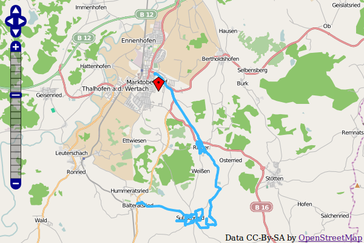

Introduction
============

What does it do?
----------------
- Show an interactive OpenStreetMap map with OpenLayers or Leaflet.
- Store coordinates in fe_users and tt_address tables and show as markers in the map.
- Show record information in popup window.
- Display gps tracks (GPX, KML).
- Display of GeoJSON vector files.

Screenshots
-----------
Frontend plugin

The example shows the output of the frontend plugin with the following settings:

* Leaflet JavaScript
* address of "Max Mustermann" as tt_address record with default marker, clickt on the  marker
* GPX track with start and stop marker

Demo Instance
-------------

At https://osm.bigga.de a demo instance of EXT:ods_osm is available which presents multiple
use cases of this extension.

Donation
--------

This extension was only possible with the help of many other free projects.

You're likely using one of the main map “Mapnik”, “Osmarender” or “Cyclemap” - feel free to
donate to the OpenStreetMap project https://supporting.openstreetmap.org/donate/

If you are using the address search (autocomplete longitude and latitude in address records),
please donate the service you use:

Geonames: https://www.geonames.org/donations.html or buy some credits there.

Nominatim: https://supporting.openstreetmap.org/donate/

And don't forget the main components: https://typo3.org/ and https://openlayers.org/ or https://leaflet.org/
