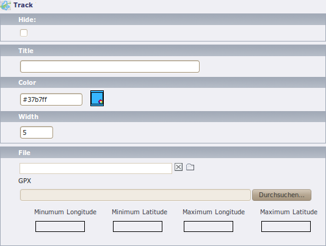
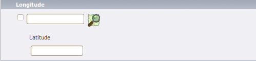

====================
 EXT: OpenStreetMap
====================
:Extension Key: ods_osm
:Description: Add an interactive OpenStreetMap map to your website. Can also show other OpenLayers compatible maps.
:Author: Robert Heel <typo3@bobosch.de>
:Copyright: 2010-2016

Introduction
============

What does it do?
----------------
- Show an interactive OpenStreetMap map.
- Store coordinates in fe_users and tt_address tables and show as markers in the map.
- Show record information in popup window.
- Display gps tracks.

Screenshots
-----------
Frontend plugin

.. image:: Documentation/Images/FrontendExample.png

Donation
--------
This extension was only possible with the help of many other free projects.

You're likely using one of the main map “Mapnik”, “Osmarender” or “Cyclemap” - feel free to donate to the OpenStreetMap project http://donate.openstreetmap.org/

If you are using the address search (autocomplete longitude and latitude in address records), please donate the service you use:

Geonames: http://www.geonames.org/donations.html or buy some credits there.

Nominatim: http://donate.openstreetmap.org/

And don't forget the main components: http://typo3.org/ and http://openlayers.org/ or http://leaflet.org/

Users manual
============

Frontend Plugin
---------------
Insert the Openstreetmap as frontend plugin and define at least one marker to show.
The map will center to the average coordinates of the markers.

.. image:: Documentation/Images/FrontendPlugin.png

+----------------------------+------------------------------------------------+
| Plugin option (TS option)  |                  Description                   |
+============================+================================================+
| Marker to show (marker)    | Show these records on the map.                 |
+----------------------------+------------------------------------------------+
| Cluster markers (cluster)  | Group nearby markers.                          |
+----------------------------+------------------------------------------------+
| Width (width)              | Width of the map in pixels.                    |
+----------------------------+------------------------------------------------+
| Height (height)            | Height of the map in pixels.                   |
+----------------------------+------------------------------------------------+
| Longitude (lon)            | Default longitude.                             |
+----------------------------+------------------------------------------------+
| Latitude (lat)             | Default latitude.                              |
+----------------------------+------------------------------------------------+
| Use this coordinates only  | If unset, the map is always centered at the    |
| if no marker exists        | given coordinates. If set, the map is only     |
| (use_coords_only_nomarker) | centered there if no marker exists.            |
+----------------------------+------------------------------------------------+
| Zoom (zoom)                | Zoom level.                                    |
+----------------------------+------------------------------------------------+
| Library (library)          | Choose between openlayers, leaflet or static.  |
+----------------------------+------------------------------------------------+
| Base layer (layer)         | Show this map. The user can switch between     |
|                            | these base layers if the layerswitcher is      |
|                            | is enabled.                                    |
+----------------------------+------------------------------------------------+
| Show popups (show_popups)  | Show a popup window with record information if |
|                            | the user hover or click a marker.              |
+----------------------------+------------------------------------------------+
| Show this marker's popup   | Open this marker's popup if the user visit the |
| initially                  | map.                                           |
| (marker_popup_initial)     |                                                |
+----------------------------+------------------------------------------------+
| Mouse navigation           | Allow navigation with the mouse.               |
| (mouse_navigation)         |                                                |
+----------------------------+------------------------------------------------+
| Show pan/zoom              | Show pan/zoom element.                         |
| (show_pan_zoom)            |                                                |
+----------------------------+------------------------------------------------+
| Show layerswitcher         | Show layerswitcher which allows the user to    |
| (show_layerswitcher)       | hide markers from the same group.              |
+----------------------------+------------------------------------------------+
| Show scalebar              | Show pan/zoom element.                         |
| (show_scalebar)            |                                                |
+----------------------------+------------------------------------------------+
| Show current position      | Center the map on the current position of the  |
| (position)                 | user (if available)                            |
+----------------------------+------------------------------------------------+

New elements
------------

Layer
.....

You can define your own layers on root level.

.. image:: Documentation/Images/Layer.png

+----------------------------+------------------------------------------------+
|       Element option       |                  Description                   |
+----------------------------+------------------------------------------------+
| Title                      | Title of this layer. Shown in layerswitcher.   |
+----------------------------+------------------------------------------------+
| Is overlay                 | Base layer or overlay layer?                   |
+----------------------------+------------------------------------------------+
| JavaScript                 || JavaScript part to create this layer.         |
|                            || ###TITLE###: Title of layer.                  |
|                            || ###VISIBLE###: Contains “'visible':true” if   |
|                            | is overlay and no layerswitcher activated.     |
+----------------------------+------------------------------------------------+
| Include static JavaScript  || Optionally include this javascript file.      |
|                            || ###STATIC_SCRIPT###: Value set by TS          |
+----------------------------+------------------------------------------------+
| Static map URL             || Download static map from this URL.            |
|                            || ###lat###: Latitude of map center.            |
|                            || ###lon###: Longitude of map center.           |
|                            || ###zoom###: Zoom level.                       |
|                            || ###width###: Image width.                     |
|                            || ###height###: Image height.                   |
+----------------------------+------------------------------------------------+
| Tile URL                   | URL to fetch tiles.                            |
|                            | Used by OpenLayers if no JavaScript defined.   |
|                            | Used by leaflet.                               |
+----------------------------+------------------------------------------------+
| Maximum zoom               | Maximum zoom level of this layer.              |
+----------------------------+------------------------------------------------+
| Subdomains                 | Tile URL subdomains (Variable {s})             |
+----------------------------+------------------------------------------------+
| Attribution                | Attribution text of this layer.                |
+----------------------------+------------------------------------------------+
| Homepage                   | Homepage URL of this layer.                    |
+----------------------------+------------------------------------------------+

Marker
......

.. image:: Documentation/Images/Marker.png

+----------------------------+------------------------------------------------+
|       Element option       |                  Description                   |
+----------------------------+------------------------------------------------+
| Title                      | Title for this track. Only shown in backend.   |
+----------------------------+------------------------------------------------+
| Icon                       | Icon file.                                     |
+----------------------------+------------------------------------------------+
| Size                       | The size of the icon. Would determined         |
|                            | automatically on save.                         |
+----------------------------+------------------------------------------------+
| Offset                     | The offset of the icon. It describes the       |
|                            | arrowhead. Would automatically choose the      |
|                            | middle bottom of the image.                    |
+----------------------------+------------------------------------------------+

Track
.....

+----------------------------+------------------------------------------------+
|       Element option       |                  Description                   |
+----------------------------+------------------------------------------------+
| Title                      | Title for this track. Shown in layerswitcher.  |
+----------------------------+------------------------------------------------+
| Color                      | Color of the track line in the map.            |
+----------------------------+------------------------------------------------+
| Width                      | Width of the track line.                       |
+----------------------------+------------------------------------------------+
| File                       | Select only one gpx file here.                 |
+----------------------------+------------------------------------------------+

Extended elements
-----------------

Website user
............

+----------------------------+------------------------------------------------+
|       Element option       |                  Description                   |
+----------------------------+------------------------------------------------+
| Longitude and Latitude     | Enter the coordinates of an address here. It   |
|                            | would determined automatically if zip or city  |
|                            | is set and autocompletion is enabled in the    |
|                            | extension manager.                             |
|                            | Use the OpenStreetMap icon to search the       |
|                            | coordinates on the map.                        |
+----------------------------+------------------------------------------------+

Website usergroup
.................

.. image:: Documentation/Images/Icon.png

+----------------------------+------------------------------------------------+
|       Element option       |                   Description                  |
+----------------------------+------------------------------------------------+
| Marker                     | Optionally specify a marker here.              |
+----------------------------+------------------------------------------------+

Administration
==============

In the extension configuration
.. image:: Documentation/Images/ExtensionConfiguration.png

+----------------------------+------------------------------------------------+
|           Option           |                   Description                  |
+----------------------------+------------------------------------------------+
| Autocomplete longitude     | You can enable to search the coordinates on    |
| and latitude               | geonames.org when saving an fe_users or        |
|                            | tt_address element.                            |
+----------------------------+------------------------------------------------+
| Use service to find        | Use this service to get the coordinates of an  |
| coordinates                | address. If you select “Only cache” you have to|
|                            | fill the cache table manually. If you select a |
|                            | provider here, be aware that the fields “zip”, |
|                            | “city” and “country” of every address record   |
|                            | you save is sent to the provider.              |
+----------------------------+------------------------------------------------+
| Contact email address      | Enter a contact email address for the service  |
|                            | provider here. If not specified, email address |
|                            | of server admin is used.                       |
+----------------------------+------------------------------------------------+
| Use local javascripts and  | Activate this if you don't like to use the     |
| images                     | javascript files from                          | 
|                            | http://www.openlayers.org/ and                 |
|                            | http://www.openstreetmap.org/ to use the local |
|                            | versions in ods_osm/Resources/.                |
+----------------------------+------------------------------------------------+

Configuration
=============

Reference
---------

.. |mpi| replace:: marker_popup_initial
.. |sls| replace:: show_layerswitcher
.. |uconm| replace:: use_coords_only_nomarker

.. |ol| replace:: openlayers

+-----------------+-----------+-------------------------------------+---------+
|     Property    | Data type |             Description             | Default |
+-----------------+-----------+-------------------------------------+---------+
| cluster         | boolean   | Cluster marker at lower map zoom.   | 0       |
+-----------------+-----------+-------------------------------------+---------+
| cluster_radius  | integer   | Cluster marker in given radius.     | 80      |
+-----------------+-----------+-------------------------------------+---------+
| external_control| boolean   || Allow control with GET or POST     | 0       |
|                 |           || lon: Map center longitude          |         |
|                 |           || lat: Map center latitudezoom: Map  |         |
|                 |           | zoom level                          |         |
|                 |           || layers: Comma separated list of    |         |
|                 |           | tx_odsosm_layer uid's               |         |
|                 |           || records: Comma separated list of   |         |
|                 |           | markers                             |         |
|                 |           || Don't forget to set no_cache=1     |         |
+-----------------+-----------+-------------------------------------+---------+
| height          | integer   |                                     | 400     |
+-----------------+-----------+-------------------------------------+---------+
| icon            | IMAGE or  | Default marker image                | Library |
|                 | TEXT      |                                     | default |
|                 | object    |                                     |         |
+-----------------+-----------+-------------------------------------+---------+
| JSlibrary       | string    | JavaScript library: none / jquery   | none    |
+-----------------+-----------+-------------------------------------+---------+
| layer           | integer   || Comma separated list of            | 1       |
|                 | list      | tx_odsosm_layer uid's.              |         |
|                 |           || 1: Mapnik                          |         |
|                 |           || 3: CycleMap                        |         |
|                 |           || 4: Seamarks                        |         |
|                 |           || 5: OpenPisteMap                    |         |
|                 |           || 13: ÖPNV Deutschland               |         |
|                 |           || 14: Hike & Bike Map                |         |
|                 |           || 15: Hillshading (NASA SRTM3 v2)    |         |
|                 |           || 16: By Night                       |         |
|                 |           || 17: Hiking routes                  |         |
|                 |           || 18: Mapnik BW                      |         |
|                 |           || 19: MapSurfer.Net Road             |         |
|                 |           || 20: MapSurfer.Net Topographic      |         |
|                 |           || 21: MapSurfer.Net Hybrid           |         |
|                 |           || 25: TransportMap                   |         |
|                 |           || 26: MapQuest                       |         |
|                 |           || 27: MapQuest Open Aerial           |         |
|                 |           || 28: Cycling routes                 |         |
|                 |           || 29: Stamen Toner                   |         |
|                 |           || 30: Stamen Watercolor              |         |
|                 |           || 31: Public Transport Lines         |         |
|                 |           || 32: Stamen Terrain Labels          |         |
+-----------------+-----------+-------------------------------------+---------+
| layerswitcher.  | boolean   | Use extra div for the layerswitcher.| 0       |
| div             |           |                                     |         |
+-----------------+-----------+-------------------------------------+---------+
| layerswitcher.  | string    | Additional options when creating    |         |
| options         |           | layerswitcher.                      |         |
+-----------------+-----------+-------------------------------------+---------+
| library         | string    | Library: leaflet / openlayers /     | |ol|    |
|                 |           | openlayers3 / static                |         |
+-----------------+-----------+-------------------------------------+---------+
| marker          | array with| Tablenames and a comma separated    | see m   |
|                 | table name| list of record ids.                 |         |
|                 | and       |                                     |         |
|                 | integer   |                                     |         |
|                 | list      |                                     |         |
+-----------------+-----------+-------------------------------------+---------+
| |mpi|           | integer   | Open popup of this marker           |         | 
+-----------------+-----------+-------------------------------------+---------+
| mouse_navigation| boolean   |                                     | 0       |
+-----------------+-----------+-------------------------------------+---------+
| no_marker       | boolean   || If no marker is set:               | 1       |
|                 |           || 0: Hide map                        |         |
|                 |           || 1: Show map                        |         |
+-----------------+-----------+-------------------------------------+---------+
| path_openlayers | string    | Overwrites the path to OpenLayers.js|         |
+-----------------+-----------+-------------------------------------+---------+
| popup           | TS object | There are two additional fields:    | see p   |
|                 |           | “group_title” and                   |         |
|                 |           | “group_description” filled with     |         |
|                 |           | group information.                  |         |
+-----------------+-----------+-------------------------------------+---------+
| position        | boolean   | Get current user postion from       | 0       |
|                 |           | browser to center the map.          |         |
+-----------------+-----------+-------------------------------------+---------+
| |sls|           | boolean   |                                     | 0       |
+-----------------+-----------+-------------------------------------+---------+
| show_pan_zoom   | integer   || 0:No                               | 0       |
|                 |           || 1:Bar                              |         |
|                 |           || 2:+/-                              |         |
+-----------------+-----------+-------------------------------------+---------+
| show_popups     | boolean   || 0:No                               | 0       |
|                 |           || 1:Click                            |         |
|                 |           || 2:Hover                            |         |
+-----------------+-----------+-------------------------------------+---------+
| show_scalebar   | boolean   | Show a scale line on the map.       | 0       |
+-----------------+-----------+-------------------------------------+---------+
| static_script   | string    | Marker ###STATIC_SCRIPT### in layer |         |
|                 |           | “Include static JavaScript”. Use it |         |
|                 |           | for google or bing maps api key.    |         |
+-----------------+-----------+-------------------------------------+---------+
| |uconm|         | boolean   | Use the default coordinates only if | 0       |
|                 |           | no marker exists.                   |         |
+-----------------+-----------+-------------------------------------+---------+
| width           | integer   |                                     | 640     |
+-----------------+-----------+-------------------------------------+---------+

m::

	pages =
	fe_users =
	fe_groups =
	tx_odsosm_track =

p::

	fe_users = COA
	fe_users {
		10 = TEXT
		10.field = name
		10.wrap = |
		20 = TEXT
		20.field = description
	}

Example
.......

::

	plugin.tx_odsosm_pi1 {
		width = 800
		height = 600
		mouse_navigation = 1
	}

Example of icon property
........................

::

	plugin.tx_odsosm_pi1 {
		icon {
			# IMAGE example
			fe_users = IMAGE
			fe_users {
				file = fileadmin/icon.png
			}
			
			# HTML example
			fe_users = TEXT
			fe_users {
				value = X
				size_x=20
				size_y=30
				offset_x=10
				offset_y=15
			}
		}
	}

Tutorial
========

1. Open or create an fe_users or tt_address record.
2. Enter zipcode or city and save the record (without closing it).
3. Scroll to the “Longitude” section and use the OSM logo to open a map.

   .. image:: Documentation/Images/Coordinates.png
   
4. Click on the correct position.
5. Save the record again.
6. Insert a content element plugin “Openstreetmap” on your page.
7. Add your address record in “Marker to show”.

   .. image:: Documentation/Images/MarkerToShow.png
